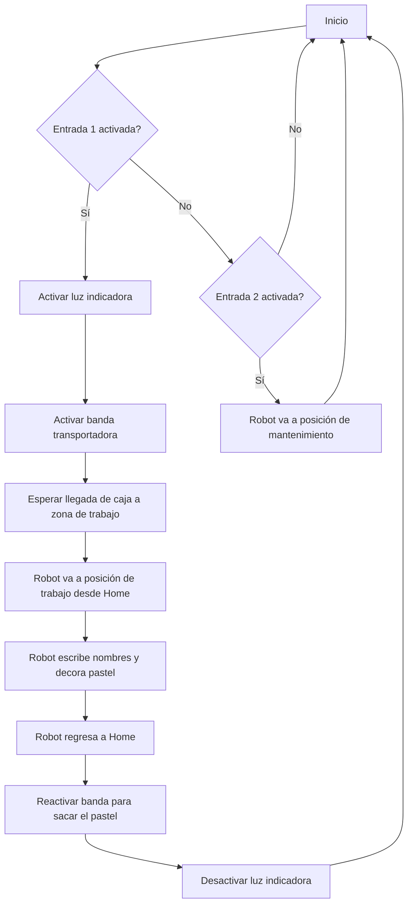

# Lab2RoboticaIndustrial
Este es el repositorio de un laboratorio desarrollado con un robot indutrial ABB

## Descripcón detallada de la solución planteada.

## Diagrama de flujo de las acciones del robot

