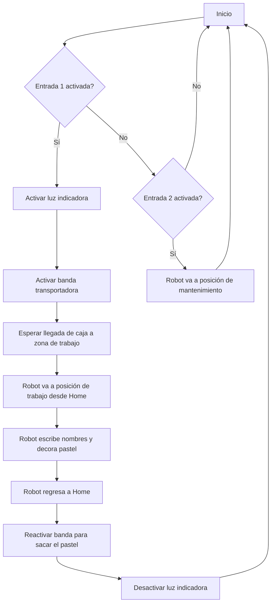

# Laboratoro 2 - Robotica Industrial
Este es el repositorio de un laboratorio desarrollado con un robot indutrial ABB

## Descripción detallada de la solución planteada.

La solución se basó en una simulación en RobotStudio complementada con pruebas físicas en un entorno real usando el robot ABB IRB140_6_81_C_03. El objetivo era automatizar el proceso de decoración de una caja, escribiendo nombres y agregando un pequeño diseño, además de moverla usando una banda transportadora simulada.

Para trabajar con precisión, se calibró la herramienta del robot usando el método de los cuatro puntos, apuntando hacia un mismo punto desde diferentes direcciones. Esto permitió definir bien la orientación de la herramienta con respecto al brazo del robot. También se configuró un workobject usando el método de tres puntos, estableciendo un origen y los ejes X e Y directamente sobre la caja, lo que sirvió como referencia para los movimientos de escritura.

En cuanto a la programación, se usaron instrucciones MoveJ para los movimientos rápidos entre posiciones, como cuando el robot se mueve desde Home hasta la zona de trabajo o hacia la posición de mantenimiento. Para la decoración, se usaron instrucciones MoveL, que permiten hacer trayectorias lineales más suaves y precisas, necesarias para escribir los nombres y el diseño.

En la simulación, se añadieron Smart Components para representar la banda transportadora y la caja. Estos componentes permitieron simular el movimiento de la caja hacia la zona de trabajo y su salida una vez decorada. También se usaron señales digitales simuladas para activar o desactivar la banda y para prender una luz indicadora mientras el robot estaba decorando.

En la parte física, además del robot y su controlador, se usó un teach pendant para manejar el robot de forma manual, y un tablero con pulsadores e indicadores LED. Este tablero permitió enviar señales al robot (como iniciar el proceso o moverlo a mantenimiento) y visualizar las salidas (por ejemplo, cuando se activa la luz indicadora).

## Diagrama de flujo de las acciones del robot

