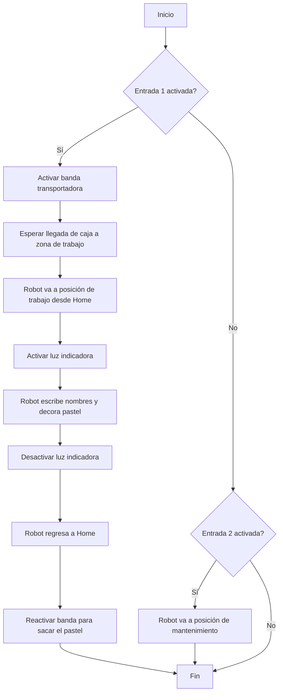

# Lab2RoboticaIndustrial
Este es el repositorio de un laboratorio desarrollado con un robot indutrial ABB

## Diagrama de flujo de las acciones del robot

```mermaid
flowchart TD
    A[Inicio] --> B{Entrada 1 activada?}
    B -- Sí --> C[Activar banda transportadora]
    C --> D[Esperar llegada de caja a zona de trabajo]
    D --> E[Robot va a posición de trabajo desde Home]
    E --> F[Activar luz indicadora]
    F --> G[Robot escribe nombres y decora pastel]
    G --> H[Desactivar luz indicadora]
    H --> I[Robot regresa a Home]
    I --> J[Reactivar banda para sacar el pastel]
    J --> K[Fin]

    B -- No --> L{Entrada 2 activada?}
    L -- Sí --> M[Robot va a posición de mantenimiento]
    M --> K
    L -- No --> K
```
