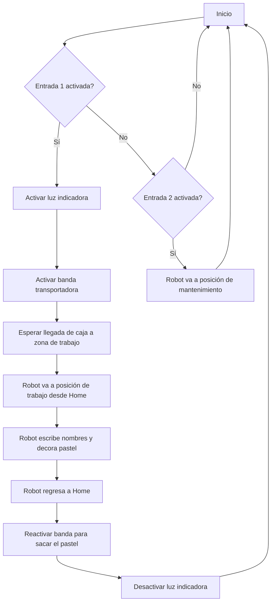

# Laboratoro 2 - Robotica Industrial
Este es el repositorio de un laboratorio desarrollado con un robot indutrial ABB

  

## Descripción detallada de la solución planteada.

La solución se basó en una simulación en RobotStudio complementada con pruebas físicas en un entorno real usando el robot ABB IRB140_6_81_C_03. El objetivo era automatizar el proceso de decoración de una caja, escribiendo nombres y agregando un pequeño diseño, además de moverla usando una banda transportadora simulada.

Para trabajar con precisión, se calibró la herramienta del robot usando el método de los cuatro puntos, apuntando hacia un mismo punto desde diferentes direcciones. Esto permitió definir bien la orientación de la herramienta con respecto al brazo del robot. También se configuró un workobject usando el método de tres puntos, estableciendo un origen y los ejes X e Y directamente sobre la caja, lo que sirvió como referencia para los movimientos de escritura.

En cuanto a la programación, se usaron instrucciones MoveJ para los movimientos rápidos entre posiciones, como cuando el robot se mueve desde Home hasta la zona de trabajo o hacia la posición de mantenimiento. Para la decoración, se usaron instrucciones MoveL, que permiten hacer trayectorias lineales más suaves y precisas, necesarias para escribir los nombres y el diseño.

En la simulación, se añadieron Smart Components para representar la banda transportadora y la caja. Estos componentes permitieron simular el movimiento de la caja hacia la zona de trabajo y su salida una vez decorada. También se usaron señales digitales simuladas para activar o desactivar la banda y para prender una luz indicadora mientras el robot estaba decorando.

En la parte física, además del robot y su controlador, se usó un teach pendant para manejar el robot de forma manual, y un tablero con pulsadores e indicadores LED. Este tablero permitió enviar señales al robot (como iniciar el proceso o moverlo a mantenimiento) y visualizar las salidas (por ejemplo, cuando se activa la luz indicadora).

## Diagrama de flujo de las acciones del robot

## Descripción de las funciones utilizadas.

En el desarrollo del programa RAPID se utilizaron varias instrucciones fundamentales para el control del robot, permitiendo definir trayectorias, ejecutar condiciones lógicas y controlar señales. A continuación, se describen las principales funciones:

1. MoveL: Esta instrucción permite mover el efector final del robot en línea recta desde su posición actual hasta una posición objetivo, garantizando una trayectoria cartesiana. Es especialmente útil para movimientos donde se requiere evitar colisiones o mantener una orientación constante del efector durante el desplazamiento.

2. MoveJ: Realiza un movimiento articular, es decir, mueve el robot de una posición a otra siguiendo la trayectoria más corta en el espacio de las articulaciones. Se usa cuando se prioriza la rapidez y suavidad del movimiento sobre la trayectoria exacta del efector.

3. WHILE...DO: Estructura de control que permite repetir un bloque de instrucciones mientras se cumpla una condición lógica. Se utilizó para mantener ciclos activos, como la espera de una señal o la repetición de una secuencia hasta que se cumpla un evento.

4. IF...THEN: Permite la ejecución condicional de instrucciones, evaluando una condición lógica. Se utilizó para tomar decisiones dentro del programa, como activar diferentes comportamientos dependiendo del estado de una señal o variable.

5. SET: Esta instrucción se emplea para activar una señal digital (por ejemplo, una salida del robot o un canal hacia otro dispositivo). Se usó para comunicar eventos o activar dispositivos externos durante la operación.

6. RESET: Contraria a SET, esta instrucción desactiva una señal digital previamente activada. Es clave para finalizar procesos o dejar señales en un estado seguro después de su uso.

7. WaitTime: Introduce una pausa temporal en la ejecución del programa. Se utilizó para asegurar tiempos mínimos entre operaciones, sincronizar eventos o permitir que un proceso externo se complete antes de continuar.

## Diseño de la herramienta detallado.

Se presentan las dos versiones de la herramienta desarrolladas para el proceso de escritura automatizada, diferenciando entre la versión física utilizada en la práctica real y la versión adaptada para simulación en RobotStudio.

- Herramienta física

Esta versión fue diseñada específicamente para montarse en el robot ABB IRB140 durante la ejecución física del experimento. El cuerpo principal incluye un espacio cilíndrico para insertar un marcador convencional, con una inclinación de aproximadamente 60 grados respecto a la vertical. Esta inclinación se definió para evitar posibles singularidades durante el movimiento del robot y mejorar la accesibilidad a la superficie del objeto a decorar.

Además, se incorporó un sistema de amortiguamiento sencillo, que permite cierta flexibilidad axial. Esto ayuda a prevenir rupturas del marcador por presión excesiva y también compensa posibles errores o incertidumbres en la posición de la superficie, producto de tolerancias mecánicas o de calibración.

  

- Herramienta simulada

Para la simulación del sistema en RobotStudio, se creó un modelo simplificado pero funcional de la herramienta. En esta versión, se representó directamente el volumen total del marcador, incluyendo su forma cónica en la punta, con el fin de tener una referencia visual precisa durante la programación de los movimientos.

Esta herramienta no incluye partes móviles ni amortiguamiento, ya que su propósito principal fue permitir la configuración y ajuste fino de la rutina de escritura en el entorno virtual, simulando el espacio ocupado por la herramienta real sin necesidad de interacción física.

  

